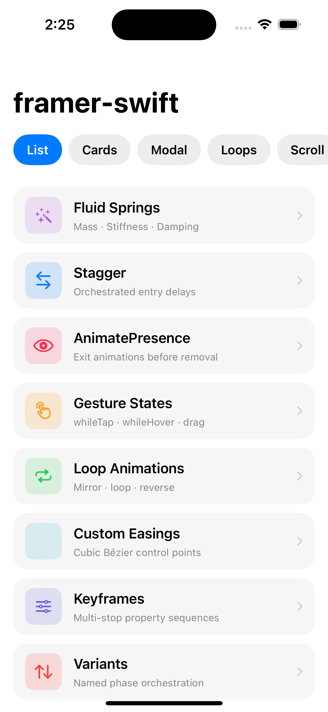
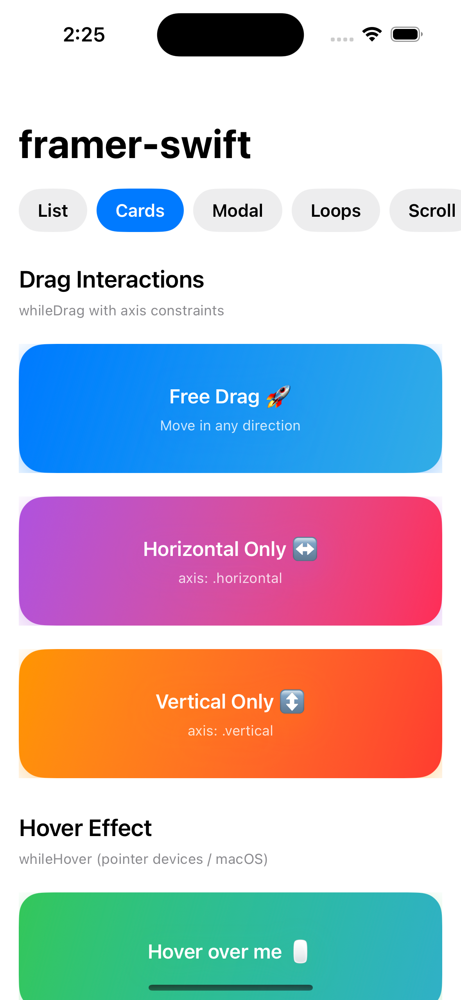
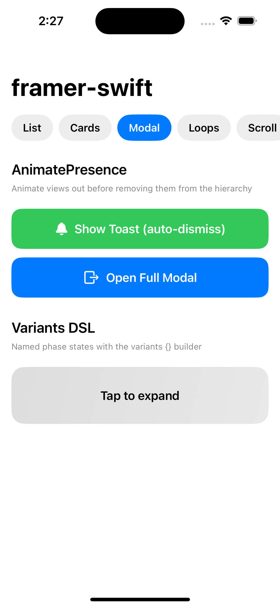
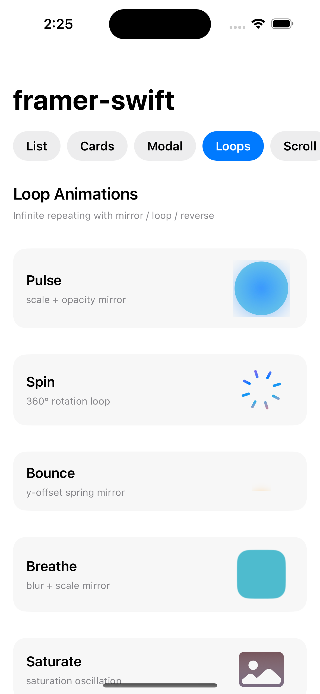
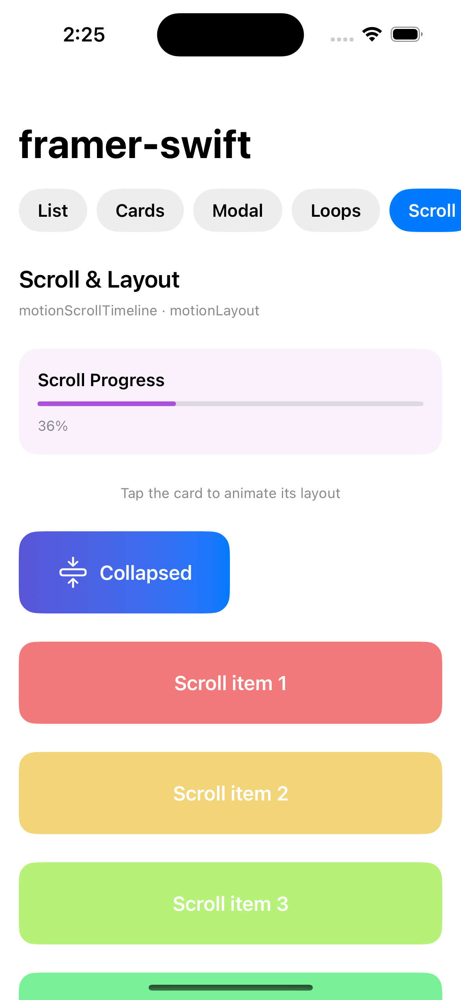
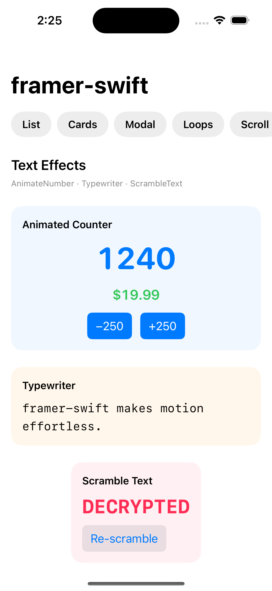
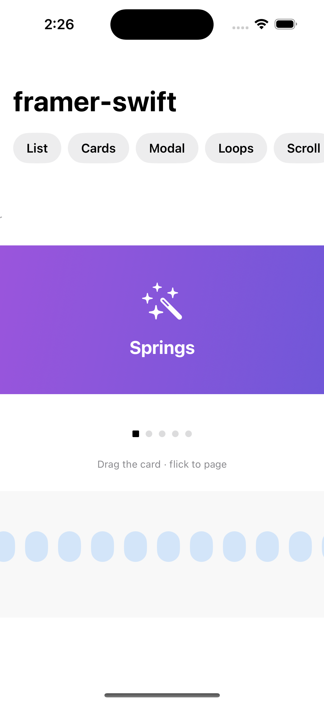

# swift-framer

> **Framer Motion for SwiftUI** — declarative, physics-based animations with a minimal API.

`swift-framer` brings the declarative simplicity and fluid feel of [Framer Motion](https://www.framer.com/motion/) to native SwiftUI. Springs, keyframes, gesture states, `AnimatePresence` exit animations and staggered orchestration — all with a single `.motion()` modifier.

[](https://swift.org)
[](https://developer.apple.com/ios/)
[](https://swift.org/package-manager/)

---

## Installation

### Swift Package Manager

Add to your `Package.swift`:

```swift
dependencies: [
    .package(url: "https://github.com/avijeetpandey/swift-framer.git", from: "1.0.0")
]
```

Or in Xcode: **File → Add Package Dependencies** and enter the repository URL.

---

## Quick Start

```swift
import SwiftUI
import FramerSwift

struct ContentView: View {
    var body: some View {
        Text("Hello, swift-framer!")
            .motion(
                initial: [.opacity(0), .y(20)],
                animate: [.opacity(1), .y(0)],
                transition: .spring(.bouncy)
            )
    }
}
```

---

## Demo

All screenshots captured live from the Example App running on iPhone 15 Pro simulator. The demo app ships inside `Example/` and can be built directly with Xcode.

### Stagger List
> **Tab: List**

Staggered entry animation where each row slides up and fades in with an incrementally increasing delay — powered by `.motion(delay:)` in a `ForEach`. Rows respond to `.whileTap` with a spring press-down effect.



---

### Draggable Cards
> **Tab: Cards**

Three cards demonstrating constrained and free-axis dragging. Cards scale up on pick-up, snap back on release with physics, and show `.whileHover` lift effects on pointer devices.



---

### AnimatePresence & Variants
> **Tab: Modal**

Demonstrates `AnimatePresence` — views animate *out* before being removed from the hierarchy. Tap **Show Toast** for an auto-dismissing notification that slides in from the top, or **Open Full Modal** for a full-screen overlay. The **Variants DSL** card expands/collapses with a named phase transition.



---

### Loop Animations
> **Tab: Loops**

Infinite repeating animations using `.mirror`, `.loop`, and `.reverse` repeat modes:
- **Pulse** — scale + opacity mirror (breathing effect)
- **Spin** — continuous 360° rotation loop
- **Bounce** — vertical spring mirror
- **Breathe** — blur + scale mirror
- **Saturate** — saturation oscillation



---

### Scroll & Layout
> **Tab: Scroll**

A real-time scroll-progress bar at the top updates as you scroll the page — driven by `.motionScrollTimeline()`. Below it, a card morphs between a compact collapsed state and a wide expanded state using `.motionLayout(id:in:)` with `matchedGeometryEffect` under the hood.



---

### Text Effects
> **Tab: Text**

Three text animation components side-by-side:
- **AnimateNumber** — smoothly interpolates between integer values with spring easing; tap −250/+250 to trigger
- **Typewriter** — character-by-character reveal with configurable speed and blinking cursor
- **ScrambleText** — characters cycle through random glyphs before resolving to the final string; tap **Re-scramble** to replay



---

### Carousel & Ticker
> **Tab: Carousel**

A velocity-aware, snappable `MotionCarousel` (drag / flick to page through 5 cards) and two infinite-scroll `MotionTicker` marquees running in opposite directions at different speeds — driven entirely by `TimelineView(.animation)` with no timers.



---

## Core Concepts

### AnimatableProperty

Every visual property you can animate:

```swift
.opacity(Double)
.scale(Double)          // uniform scale
.scaleX(Double)
.scaleY(Double)
.x(Double)              // horizontal translation (pts)
.y(Double)              // vertical translation (pts)
.rotation(Double)       // degrees, around Z
.rotationX(Double)
.rotationY(Double)
.blur(Double)           // radius in pts
.brightness(Double)     // -1 to 1
.saturation(Double)
.width(Double)
.height(Double)
.cornerRadius(Double)
.foregroundColor(Color)
.clipShape(AnyShape)
```

### MotionTiming

Choose your timing curve:

```swift
.spring(.bouncy)                          // SpringConfiguration preset
.spring(.gentle)
.spring(.stiff)
.spring(mass: 1, stiffness: 200, damping: 15)
.tween(duration: 0.4)
.tween(duration: 0.3, easing: .easeInOut)
.tween(duration: 0.5, easing: .backOut)
.keyframes([...])
```

### MotionTransition

```swift
MotionTransition(
    timing: .spring(.bouncy),
    delay: 0.1,
    repeatCount: .finite(3),
    repeatDelay: 0.2
)
```

---

## .motion() Modifier

The primary API. Attach to any SwiftUI view:

```swift
// Animate on appear
myView.motion(
    initial: [.opacity(0), .scale(0.9)],
    animate: [.opacity(1), .scale(1)],
    transition: .spring(.gentle)
)

// With exit animation
myView.motion(
    initial: [.opacity(0), .y(40)],
    animate: [.opacity(1), .y(0)],
    exit:    [.opacity(0), .y(-40)],
    transition: .spring(SpringConfiguration(response: 0.4, dampingFraction: 0.8))
)

// Trigger on value change
myView.motion(
    animate: [.scale(isHighlighted ? 1.1 : 1.0)],
    transition: .spring(.stiff)
)
```

---

## AnimatePresence

Animate views *out* before they are removed from the hierarchy:

```swift
@State private var showBanner = false

AnimatePresence(isPresent: showBanner) {
    BannerView()
        .motion(
            initial: [.opacity(0), .y(-20)],
            animate: [.opacity(1), .y(0)],
            exit:    [.opacity(0), .y(-20)],
            transition: .spring(.gentle)
        )
}
```

---

## Stagger Animations

Orchestrate list entries with incremental delays:

```swift
StaggerContainer(stagger: 0.06) {
    ForEach(items) { item in
        StaggerChild {
            RowView(item: item)
                .motion(
                    initial: [.opacity(0), .x(-24)],
                    animate: [.opacity(1), .x(0)],
                    transition: .spring(.gentle)
                )
        }
    }
}
```

---

## Gesture States

### whileTap

```swift
button.whileTap([.scale(0.95), .opacity(0.8)]) {
    handleTap()
}
```

### whileHover (iPadOS pointer / macOS)

```swift
card.whileHover([.scale(1.04), .brightness(0.05)])
```

### whileDrag

```swift
card.whileDrag(
    [.scale(1.02)],
    inactive: [.scale(1.0)],
    axis: .horizontal,
    onDragEnd: { offset, velocity in
        snapBack(velocity: velocity)
    }
)
```

### whileLongPress

```swift
view.whileLongPress([.scale(0.9)], minimumDuration: 0.5) {
    handleLongPress()
}
```

---

## Loop Animations

```swift
// Infinite mirror (ping-pong)
dot.motion(animate: [.x(100)], transition: .spring(.gentle))
   .motionLoop(count: .infinite, mode: .mirror)

// Finite forward loop
icon.motion(animate: [.rotation(360)], transition: .tween(duration: 1.0))
    .motionLoop(count: .finite(3), mode: .loop)
```

---

## Variants (Named Phases)

```swift
let card = variants {
    MotionVariantState(name: "hidden",  properties: [.opacity(0), .scale(0.9), .y(20)])
    MotionVariantState(name: "visible", properties: [.opacity(1), .scale(1.0), .y(0)])
    MotionVariantState(name: "exit",    properties: [.opacity(0), .scale(0.95), .y(-20)])
}

MotionView(variantSet: card, current: "visible") {
    CardContent()
}
```

---

## Property Presets

```swift
// Built-in preset arrays
[AnimatableProperty].fadeIn       // [.opacity(0)] → [.opacity(1)]
[AnimatableProperty].slideInFromLeft
[AnimatableProperty].slideInFromRight
[AnimatableProperty].slideInFromTop
[AnimatableProperty].slideInFromBottom
[AnimatableProperty].popIn        // scale(0.8) + opacity(0) entry
```

---

## Spring Configuration

```swift
// Presets
SpringConfiguration.default    // balanced
SpringConfiguration.gentle     // slow, smooth
SpringConfiguration.stiff      // fast, tight
SpringConfiguration.wobbly     // bouncy overshoot
SpringConfiguration.slow       // overdamped
SpringConfiguration.bouncy     // strong underdamped

// Custom (using response/dampingFraction)
SpringConfiguration(response: 0.5, dampingFraction: 0.7)

// Custom (physics parameters)
SpringConfiguration(mass: 1.0, stiffness: 180, damping: 12)
```

---

## Reduced Motion

`swift-framer` automatically respects the system accessibility setting:

```swift
// Global override
.motionConfiguration(MotionConfiguration(reducedMotion: true))

// Or it reads `@Environment(\.accessibilityReduceMotion)` automatically
```

---

## MotionValue (render-cycle-free state)

`MotionValue` tracks a value **outside** SwiftUI's render cycle — ideal for
high-frequency signals (scroll, drag, pointer) where re-rendering `body` every
frame is too expensive. Update it freely; only an explicit `MotionValueReader`
bridges it back into the view tree.

```swift
let scrollProgress = MotionValue<Double>(0)

// Derive new values with map / transform (like useTransform)
let headerOpacity = scrollProgress.transform(inputRange: 0...0.3, outputRange: 1...0)

// Subscribe imperatively (returns a cancellable token)
let token = scrollProgress.onChange { value in
    print("progress:", value)
}

// Bridge into SwiftUI only where needed
MotionValueReader(headerOpacity) { opacity in
    HeaderView().opacity(opacity)
}
```

---

## Scroll-Linked Animations

Drive animations from scroll position with `.motionScrollTimeline`. Name a
coordinate space on the scroll container, then map the travel window to `0...1`:

```swift
ScrollView {
    content
        .motionScrollTimeline(in: "feed", start: 180, distance: 500) { snapshot in
            progress = snapshot.progress   // 0...1
        }
}
.coordinateSpace(name: "feed")

// Or write straight into a MotionValue<Double>:
content.motionScrollTimeline(in: "feed", distance: 500, progress: scrollProgress)
```

---

## Layout Animations

`.motionLayout(id:in:)` fluidly animates a view between two different layout
states using a shared `Namespace` (matched-geometry under the hood):

```swift
@Namespace private var ns

if expanded {
    Card().frame(maxWidth: .infinity, height: 180)
        .motionLayout(id: "card", in: ns)
} else {
    Card().frame(width: 180, height: 70)
        .motionLayout(id: "card", in: ns)
}
// Toggling `expanded` springs the card between layouts.
```

---

## Pro Components

### AnimateNumber

Smoothly counts between numeric values using the library's own timing engine:

```swift
AnimateNumber(value: total, timing: .spring(.gentle),
              format: { String(format: "$%.2f", $0) })
```

### Typewriter

Reveals text one character at a time with a blinking cursor:

```swift
Typewriter("framer-swift makes motion effortless.",
           charactersPerSecond: 18, cursor: "|")
```

### ScrambleText

Resolves text through a decoding scramble effect. The pure `TextScrambleEngine`
is independently testable and seedable for deterministic output:

```swift
ScrambleText("DECRYPTED", duration: 1.4,
             engine: TextScrambleEngine(seed: 42))
```

### MotionTicker

An infinitely scrolling, seamlessly looping marquee. Supply your data **once** —
looping is automatic (no manual cloning):

```swift
MotionTicker(items: headlines, spacing: 12, speed: 55, direction: .leading) { item in
    Text(item.text).padding(.horizontal, 14).padding(.vertical, 8)
        .background(.blue.opacity(0.15), in: Capsule())
}
.frame(height: 40)
```

### MotionCarousel

A draggable, snappable, velocity-aware paging carousel. Snap math lives in the
pure `CarouselSnapCalculator`:

```swift
@State private var page = 0

MotionCarousel(items: cards, selection: $page, sidePadding: 32) { card in
    CardView(card)
}
.frame(height: 200)
```

### customCursor (iPadOS pointer)

Magnetic pointer interaction with an `idle → active → magnetic` state machine and
the native hover effect:

```swift
Button("Open") { }
    .customCursor(magneticScale: 1.1) { state in
        // react to .idle / .active / .magnetic
    }
```

---

## Architecture

```
Sources/FramerSwift/
├── Core/
│   ├── Protocols/   — AnimationPhase, AnimatableProperty, EasingFunction, MotionVariant …
│   └── Math/        — SpringSimulator, TweenInterpolator, KeyframeSequence, ValueInterpolator
├── Engine/          — MotionViewModel, PropertyApplicator, AnyShape
├── Modifiers/       — MotionModifier, MotionStateModifier, AnimationTriggerModifier
├── Extensions/      — MotionView, MotionVariantBuilder, .motion() View extension
├── Gestures/        — WhileTapModifier, WhileDragModifier, WhileHoverModifier, LongPressMotionModifier
├── Orchestration/   — AnimatePresence, StaggerContainer, LoopModifier, MotionSequenceStep
├── State/           — MotionValue, MotionValueReader, MotionValueSubscription
├── Scroll/          — ScrollTimelineModifier, MotionScrollProgress, .motionScrollTimeline()
├── Layout/          — MotionLayoutModifier, .motionLayout()
└── ProComponents/   — AnimateNumber, Typewriter, ScrambleText, MotionTicker,
                       MotionCarousel, CustomCursorModifier
```

---

## Requirements

- iOS 15.0+ / macOS 12.0+
- Swift 5.9+
- Xcode 15.0+

---

## License

swift-framer is available under the MIT license.
